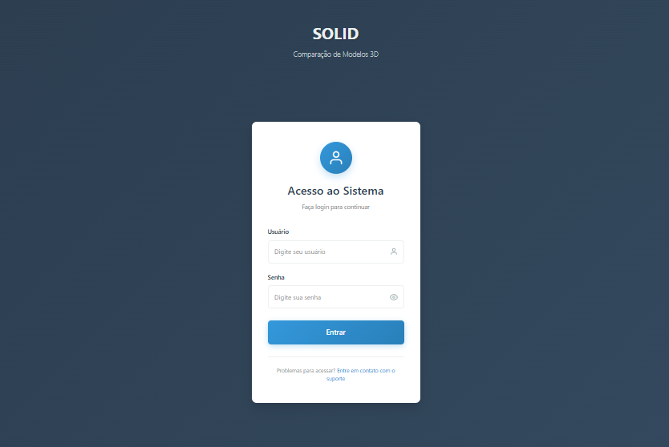
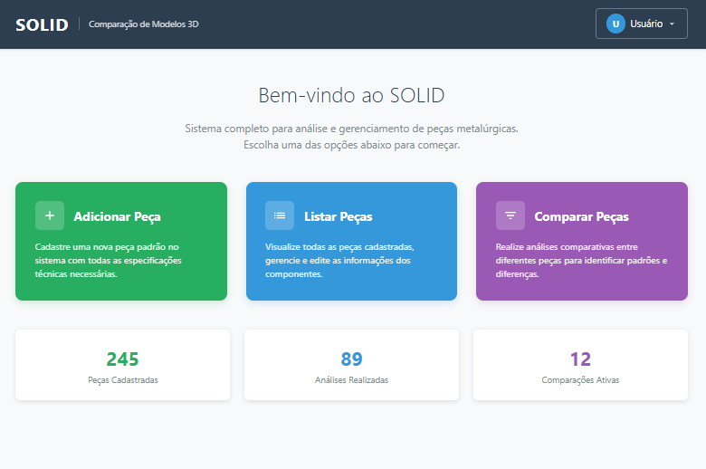
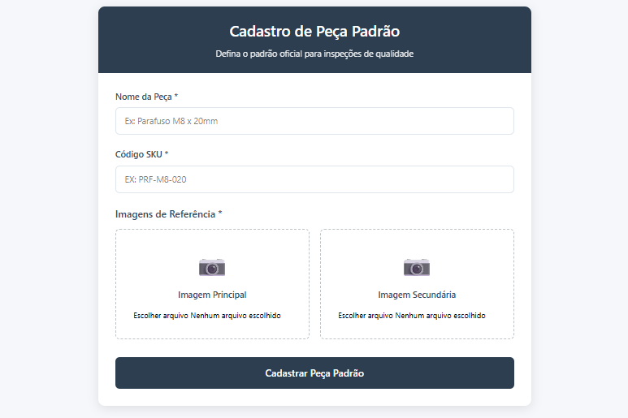
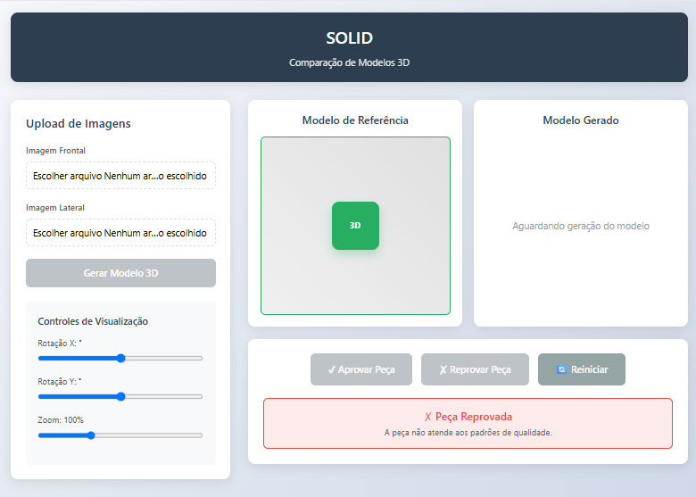

## 💻 Protótipo do Sistema SOLID: Comparação de Modelos 3D

Este protótipo de sistema, chamado **SOLID**, é uma plataforma para análise e gerenciamento de peças metalúrgicas, focada na comparação de modelos 3D para controle de qualidade.

-----

### 1\. Acesso ao Sistema

#### 1.1. Acesso (Login)

A tela de login é o ponto de entrada para o sistema.

Permite que os usuários insiram seu **Usuário** e **Senha** para acessar o sistema.

#### 1.2. Cadastro de Usuário (Signup)

Esta tela é utilizada para registrar novos funcionários no sistema, definindo suas credenciais e nível de acesso.

Solicita informações como Nome Completo, Matrícula, Ramal, Setor, Cargo, Supervisor e **Nível de Acesso** (que determina as funcionalidades permitidas). |

-----

### 2\. Tela Principal (Home)

Após o login, o usuário é direcionado para o painel principal, que oferece uma visão geral e as principais funcionalidades do sistema.

Oferece acesso rápido às três principais ações: **Adicionar Peça** (Cadastro), **Listar Peças** (Catálogo) e **Comparar Peças** (Análise). Exibe também um resumo dos dados do sistema: **Peças Cadastradas**, **Análises Realizadas** e **Comparações Ativas**.

-----

### 3\. Gestão de Peças

#### 3.1. Listagem de Peças (Catálogo)

A tela de gestão exibe o catálogo completo de modelos e especificações.

Lista todas as peças cadastradas com informações como **SKU**, **Nome**, **Categoria**, **Vista Frontal** e **Vista Lateral**. Permite as ações de **Editar** ou **Excluir** peças e o botão para **Adicionar Nova Peça**. |

#### 3.2. Cadastro de Peça Padrão

Esta tela é utilizada para inserir uma nova peça padrão no sistema, que servirá de referência para futuras inspeções.

Solicita o **Nome da Peça**, o **Código SKU** e as **Imagens de Referência** (Principal e Secundária) para definir o padrão oficial. 

-----

### 4\. Análise e Comparação

#### 4.1. Comparação de Modelos 3D

Esta é a principal ferramenta de qualidade, onde o modelo gerado é comparado com um modelo de referência.

Permite o **Upload de Imagens** (Frontal e Lateral) para **Gerar Modelo 3D**. Exibe o **Modelo de Referência** e o **Modelo Gerado** lado a lado. Na parte inferior, mostra o resultado da análise (neste caso, "Peça Reprovada") e os botões de ação: **Aprovar Peça**, **Reprovar Peça** e **Reiniciar**. Inclui também **Controles de Visualização** (Rotação X, Rotação Y e Zoom) para os modelos. |
